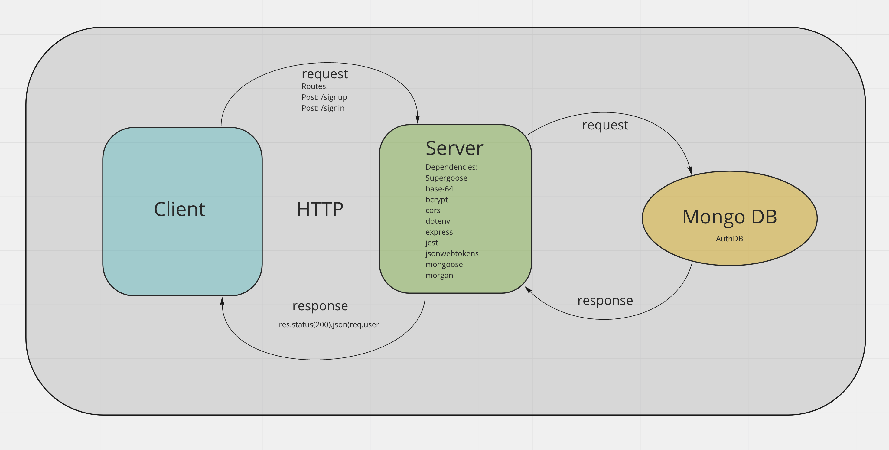

# 401 Lab 07 - Bearer Auth Server

**Author: Jessi Velazquez**

**Repository Name:** bearer-auth

**Branch name:** dev

## Links

Deployed Link: [https://jessi-bearer-auth.herokuapp.com/](https://jessi-bearer-auth.herokuapp.com/)

Github Actions: [https://github.com/JessiVelazquez/bearer-auth/actions](https://github.com/JessiVelazquez/bearer-auth/actions)

Pull Request: [https://github.com/JessiVelazquez/bearer-auth/pull/5](https://github.com/JessiVelazquez/bearer-auth/pull/5)

## Setup

1. Clone down github repository

2. Run ```npm i``` at terminal to install dependencies

3. Run ```nodemon``` or ```node index.js``` at terminal to start server

## Description

This is a bearer server application that allows a new user to sign up with username and password on the signup route, or validates an existing user's credentials on the /signin route.

A valid JSON data object looks like this:

```
{ "username": "sampleUser", "password": "samplePassword" }
```

## Testing

To run tests, start the server and run ```npm run test``` at the terminal to run all tests

## Architecture

├── LICENSE
├── README.md
|__.gitignore
├── __tests__
│   └── basic-auth-middleware.tests.js
│   └── bearer-auth-middleware.tests.js
│   └── router.tests.js
├── index.js
├── package-lock.json
├── package.json
└── src
    |__server.js
    |__auth
        ├── middleware
        │   └── basic.js
        │   └── bearer.js
        ├── models
        │   └── users.js
        ├── routes.js
        └── server.js


**Web Request Response Cycle**




## Contributors

Pair programming partners/collaborators were Dan Engel, Lydia Minehan-Tubic.